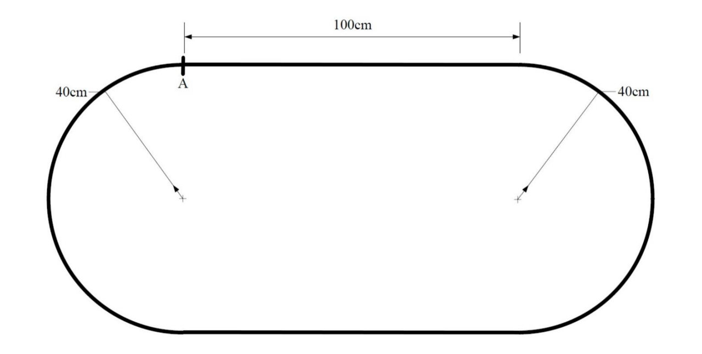
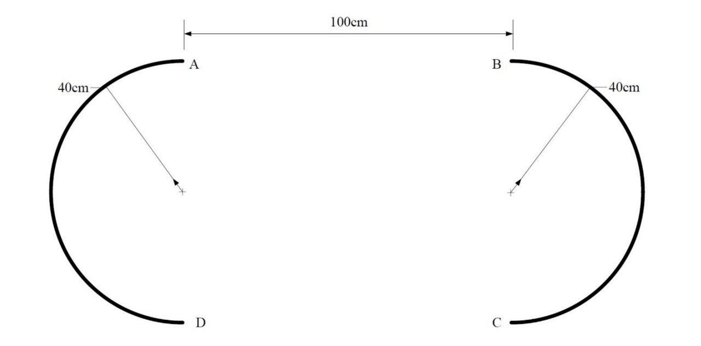

# CarDo
## 项目简介
基于stm32f103RCxT6的小车控制系统，实现小车的蓝牙通信、自动寻迹等功能。

## 任务说明
### 发光二极管阵列的焊接与调测
1. 焊接练习板
2. 焊接发光二极管阵列
#### 智能四轮车
1. 基础要求：小车从A点触发沿黑线自动循迹，返回A点停止
2. 提高要求：在提高赛道中，小车能从A点出发后，自动行驶到B点，沿半弧线行驶到C点，再由C点行驶到D点，最后沿半弧线行驶到A点停车
3. 在提高赛道中，小车能从A点出发后，自动行驶到C点，沿半弧线行驶到B点，再由B点行驶到D点，最后沿半弧线行驶到A点，完成三圈记录完成时间
<div style="display: flex; justify-content: space-around; align-items: center; text-align: center;">
    <div>
        
        <span style="color: gray;">基础赛道</span>
    </div>
    <div>
        
        <span style="color: gray;">提高赛道</span>
    </div>
</div>

## 项目设计思路与实现过程
### 项目迁移
#### 工具链与IDE
原始工程采用了Keil5进行开发，为了适应后续的开发协作流程，我们切换到了Clion+CMake+GCC+OpenOCD的开发环境，这种开发流更加现代而通用，开发体验好，功能完善，通用性强。
- `Clion` 相较于Keil5，Clion具有更好的代码提示、代码补全、代码格式化等规范化功能，并可集成可视化Git工具，调试器，脚本工作流等功能。
- `CMake` 作为跨平台的构建工具，可以方便的管理工程的构建流程，同时也可以方便的管理工程的依赖关系。
- `GCC` 使用`arm-none-eabi-gcc`进行交叉编译。
- `OpenOCD` 开源芯片调试工具，支持芯片库广泛，并提供了强大的调试功能，包括寄存器、内存器查看，断点设置功能等等，方便后续的开发。

#### ESP32启用蓝牙调参
STM32在板端实现了对ESP32的电源控制、烧录模式切换、复位、串口通信的硬件支持。

在`esp32.c`当中我们可以找到上述功能的软件实现。

本版本的硬件存在PA9/PA10(TxRx)接反的问题，因此在esp32的固件中需要使用引脚矩阵配置，对串口的初始化进行了反转修改。

在USBDMA接收中断中，对接收指令进行了解析，当USB-CDC串口收到FLASH指令时，stm32将切换esp32的模式进入指令烧写模式，当USB-CDC串口接收到的内容不匹配任何指令时，将会通过DMA直接将数据发送给esp32。(具体分析见后续章节)

**烧录流程** 
1. 通过USB-CDC端口发送`FLASH`指令
2. 启动ESP-Tools进行固件烧录
   
    [esp-tools](https://espressif.github.io/esptool-js/)

    [BootLoader-0x1000](esp32_bin/bootloader.bin)

    [Partions-0x8000](esp32_bin/partitions.bin)

    [固件-0x10000](esp32_bin/SerialToSerialBT_Legacy.bin)

3. 重启小车，进入正常模式

小车重启后，电脑等设备即可搜索到蓝牙设备，连接后即可通过蓝牙串口进行调试。

#### Git代码管理
在项目的开发过程中，我们使用了Git进行版本控制，方便团队协作，同时也方便了工程版本的管理。

本项目使用Github进行代码托管，地址为：[CarDo2024](https://github.com/bxhsiman/CarDo2024)

### 通信与命令调试
#### 外设层
项目启用了Usart1-3 三个外设进行三个方向的通信，并启用了USB功能配置为CDC设备进行通信。其中Uart1为ESP32透传串口，Uart2为ESP32调试与烧录串口，Uart3为Jtag调试串口。其中Uart2-3和CDC配置了DMA进行数据收发，Uart1使用中断/轮询方式进行通信。
#### DMA配置
在外设的IDLE中断中，可以配置接收到一段数据后的数据处理方式，我们参考原始代码中的ESP32控制方法，在USB_RxDataCallback当中将USB Rx的DMA Buffer全部搬移到Uart2的DMA Tx Buffer，实现大带宽数据的透传。由于115200的串口波特率与USB设备串口速率不对应，实际丢包严重，使用的ESP flash tool使用带有重传的通信协议，能够实现代码的烧录。
为方便调试，我们将Uart2 DMA Rx Buffer搬移到Uart3 的Tx，将Uart3 的Rx 搬移到Uart2 的Tx，实现对ESP32的串口调试。
#### 应用层
命令解析应用在原始中被抽象为Uart/USB的Rx回调函数，我们将命令解析配置到Uart1和Uart3的Rx回调上，实现对蓝牙来源和Jtag来源的命令解析。根据实际需求(IMU，蓝牙)，增加了几条额外指令进行调试和发车。
Printf函数在MDK工程中使用MicroLib库的实现，在迁移到GCC后我们配置使用NewLib库进行实现，修改_write()函数从DMA或中断的方式打印格式化数据，并且在Cmake中配置了对浮点数的支持，从而实现的更加方便的打印调参功能。

## 任务实现
### 基础要求
原始代码工程中即包含完成此任务的全部代码，针对测试中出现的问题，我们做了以下调整。
#### 光电管阈值校准
由原先的采集黑线阈值，上下浮动300判定黑线修改为同时采集黑线和白色区域，根据两者的平均值进行阈值的校准，这种方法改善了由于赛道环境的变化导致的阈值浮动过大的问题。
``` c
 int temp_threshold = (adc_value_max - adc_value_min) / 2;
            if (temp_threshold > 0) {
                g_CarConfig.adc_compare_gate = temp_threshold;
            } else {
                g_CarConfig.adc_compare_gate = 1000;
            }
            printf("adc_compare_gate is set to %d\n", g_CarConfig.adc_compare_gate);
            UserFlashDataWrite(&g_CarConfig);
            HAL_TIM_Base_Start_IT(&htim7);
```

#### 启动条件的处理
原工程的启动状态机有问题，启动的黑线条件容易触发停车条件，我们设置了启动死区，用以避免启动时的对终止条件的误判。

#### 加减速条件判定
原有方案的加速条件过于保守，且起步即设置为`tr_speed`，容易冲出赛道，我们将加速条件修改为更短的直行运行时间，并且调低了`tr_speed`的值，设置了更加合适的`speed_max`和`speed_min`使得小车更平滑启动和加速。

#### PID调试
我们充分使用了串口命令功能，通过蓝牙串口打印PID的参数，并可以实时调试PID参数，写入FLASH长期保存，大幅提升了调参的速度和准确性。

以下是我们的PID调整思路，仅供参考：
1. 确定一个较快的速度，设置一个初始Kp(不必太大)，清空Kd，准备调整参数。
2. 倍加Kp，直到小车出现震荡，然后二分找到一个小车震荡但是巡线效果较好的Kp。
3. 倍加Kd，观察震荡收敛速度，直到震荡被抑制到难以巡线，而后二分找到一个收敛较快的Kp。
4. 如此往复，逐渐提速。

经过测试，我们给微分项增加了滑动窗口滤波，以平滑微分项，自此，小车的巡线效果得到了极大的提升。

除此之外，在提高题目中观察到小车外侧光电管权重过大，入弯容易摆动，在短时间无法通过调优PID计算方法解决，我们选择削弱外侧光电管的权重，将其变为非线性，抑制小车外摆严重的问题。


### 提高要求1
#### 陀螺仪的使用
该部分代码详见`Core/Usr/*MPU6050*` `Core/Usr/angleCtrl*`。

我们使用了`MPU6050`构建了角度环，以在此题目的无线区域进行角度闭环控制。

<div style="display: flex; flex-direction: column; align-items: center;">
<image src="image/mpu6050示意图.png" style="max-width: 50%; height: auto;"> </image>
<span style="color: gray;">MPU6050示意图</span>
</div>
MPU6050是一块6轴IMU，具有三轴加速度计和三轴陀螺仪，本次任务主要需要采集Z轴角加速度经过滤波后积分出Yaw(偏航角)即当前小车的车头角度。

<a name="零漂问题"></a>
由于六轴IMU缺少地磁计，我们无法对Yaw进行卡尔曼滤波，该角度存在零漂和较严重的累计误差，对于零漂，我们在初始化静止时对加速度进行多次采集取平均，后需积分时减去零漂以修正。对于累计误差我们在后续的使用过程中进行了简单的经验修正。

<a name="IIC问题"></a>
在驱动IMU的过程中遇到了硬件IIC容易受到电磁干扰而锁死MCU的问题，通过GDB调试可以定位问题出现在HAL库的硬件IIC实现，在接受从机消息时出现比特翻转将无法释放总线到等待模式。由于时间紧张，在测试减小上拉电阻稳定总线无果后选择采用软件IIC临时解决问题。其驱动详见`Core/Usr/*IIC*`

#### 角度环PID调整
类似方向环PID的调节方法，我们先不在赛道上调试角度环，以下是调整方法仅供参考：
1. 向前速度设置为0，给出初始角度为90°。
2. 增大Kp直到小车能够转向90°。
3. 增大Kd以抑制震荡。
4. 调节Ki以消除静态误差。

实际调试中，由于小车低速下电机无法启动带动小车转向，PID是在小车在执行提高任务1高速下进行调试的，赛道较短，时间紧张，并且巡线PID调整合适，我们只调试出合适Kp值提供方向上简单的修正即可。

#### 增加角度环条件
原始代码在丢线(光电管全白)后将会进入倒车找线状态，我们也观察到有的组使用倒车找线进行角度修正。由于我们可以进行角度闭环控制，故放弃使用这种方法。

我们的状态机修改为：在丢线后小车被角度环接管，通过角度环PID，将小车锁在距发车180°方向，直到重新检测到黑线。

经过测试，此方案可以适配大多数赛道，且在白色区域对角度偏差进行修正效果好，小车运行中受到撞击颠簸仍然可以修正会原有角度进行行驶，也因此我们提高要求1速度较快。


### 提高要求2
#### 状态机的设计
由于提高要求2的状态较多，我们重写了原有双层状态机的第二层，详细内容见`Core/Usr/st*`。

具体的状态机设计如下：
```c
enum UP2_State
{
    UP2_STATE_READY = 0,            // 准备状态
    UP2_STATE_BLACK_TRACKING = 1,   // 黑线跟踪
    UP2_STATE_WHITE_STRIGHT = 2,    // 白区直行
    UP2_STATE_TURN_RIGHT = 3,       // 右转
    UP2_STATE_TURN_LEFT = 4,        // 左转
    UP2_STATE_STOP = 5,             // 停车
    UP2_STATE_FINDLINE_LEFT = 6,    // 左找线
    UP2_STATE_FINDLINE_RIGHT = 7,   // 右找线
    UP2_STATE_ERROR                 // 错误状态
};
```
状态转移使用函数`static void trans_state(uint8_t state)`进行管理，并在转移函数中实现了状态计数，以正确判定进入左转或者右转状态。

整体状态机工作流程图:
```c
"UP2_STATE_READY"-->"黑线跟踪"-丢线->"右转"-->"右转找线"-角度环完成&&扫线成功->"黑线跟踪"-丢线->"左转"-->...
```

#### 核心状态代码解读
由于存在角度环，本任务最困难的点仅仅在于左转/右转后，车辆无法找到黑线，即无法正常从"右转"状态进入"黑线跟踪"，我们特意设置"左/右转找线"状态以修正角度，使小车能够正常进入"黑线跟踪"状态。

<a name="角度修正"> </a>  

**左/右转状态**
```c
case UP2_STATE_TURN_RIGHT: {
//            if (turn_right_cnt == 4) { //后期任务修改 无需停车
//                trans_state(UP2_STATE_STOP);
//            }
            int16_t yaw_speed = 0;
            yaw_speed = AnglePID(g_yaw + 46 - turn_right_cnt * 1.2f ); //增加修正的角度设置

            yaw_speed = LIMIT_MAX(yaw_speed, -300, 300);    //限幅 避免无法驱动轮子 
            static uint32_t t = 0;

            if (++t > 100) { //调试用
                t = 0;
                printf("yaw is %.2f\n", g_yaw);
                printf("yaw speed is %d\n", yaw_speed);
            }

            StopAllMoto();
            CarMotoCtrl(300 + yaw_speed, 300 - yaw_speed); //角度环控制

            static uint32_t enter_times = 0;
            if (g_TrackStatus.full_white != 1) {
                enter_times++; //滤波 避免褶皱影响
                if (st_time > 100 && enter_times > 3) {
                    trans_state(UP2_STATE_FINDLINE_RIGHT);
                }
            }
            break;
        }
```
当小车确实碰到黑线的时候就会转移状态，进入找线状态。

**左/右转找线状态**
```c
case UP2_STATE_FINDLINE_RIGHT: {
            // 角度处理代码省略

            if (!((g_TrackStatus.adc_value & 0x01) || (g_TrackStatus.adc_value & 0x10))) { //中间两个光电管有黑线 则进入黑线跟踪
                StopAllMoto();
                trans_state(UP2_STATE_BLACK_TRACKING);
                return;
            }

            if (g_yaw < 0 ? g_yaw > (target_yaw - 10) : g_yaw < -(target_yaw - 10)) { //对准黑线后 摇摆前进
                StopAllMoto();
                static uint32_t find_middle_line = 0;
                if (++find_middle_line < 2500) {
                    CarMotoCtrl(300, 400);
                } else {
                    CarMotoCtrl(400, 300);
                    find_middle_line = 0;
                }
                return;
            }
            //调试相关代码以省略
            StopAllMoto();
            CarMotoCtrl(0 + yaw_speed, 0 - yaw_speed); //若未对准黑线(+-180°)则继续修正角度环
            break;
        }

```
此状态的重要意义在于修正小车入弯时角度导致的PID反转问题。
<div style="display: flex; flex-direction: column; align-items: center;">
<image src="image/角度反转示意图.png" style="max-width: 50%; height: auto;"> </image>
<span style="color: gray;">最右侧光电管正常巡线时将提供右转的error，但是入左弯姿态下，右转极易冲出赛道</span>
</div>

小车入弯时极易外侧光电管先一步撞击到黑线，由于此时线完全在小车外侧，方向环PID会将小车向右方弹出，导致无法巡线。

此问题我们进行了多次尝试:

0. 调节PID，黑盒解决问题，但是没有时间。
1. 进入转弯状态后调节外侧光电管权重为较大负值，效果极差。
2. 降低外侧光电管权重，效果依然不明显。
3. 增加新状态，通过更长时间的角度修正(摇摆前进)保证黑线存在于光电管中间时再切换状态。
   
正因此，我们的小车可以实现大角度入弯，结合角度环实现了与时间的解耦，从而避免了时间积分带来的较大误差，我们在本任务实现了更多圈数。


## 遇到的问题和解决方案

### 电磁干扰
除了上述章节讨论过的[IIC问题](#IIC问题)，我们还发现在小车高速运行时，按钮经常出现误触发问题。

检查PCB发现驱动和信号电路没有隔离，并且采用了两层板设计，按钮没有电容硬件滤波。

解决方案:
1. 给按钮驱动增加软件滤波。
2. 焊接电容以硬件滤波

该问题触发次数不多，时间紧张，故没有解决。

### IMU角度漂移
理论分析见[提高要求1](#零漂问题)。即使在积分时对零漂进行了修正，我们发现小车在多圈运行中仍然会出现积分误差，因此在每一圈积分后，都会根据经验对角度值进行整体修正。代码见[左/右转状态](#角度修正)

除去以上问题，我们还在迁移工程时遇到了Jtag驱动，MicroLib不支持，ESP32串口反转等问题，均在前文中有所提及。 

### 卡尔曼滤波失效
迁移工程后，我们发现原有的卡尔曼滤波算法在我们的工程中下无法正常工作，GDB调试进入卡尔曼部分后内存出现溢出，考虑可能是C语言版本问题。对卡尔曼滤波算法进行重构后解决问题。

## 总结和体会
本次任务中，我们花费了大量的时间进行工程迁移和ESP32、MPU6050的驱动开发，而三者均对我们的任务起到了至关重要的作用，也是为我们后续的学习工作提供了宝贵的实践经验。

在不断解决各种软硬件问题的过程中我们发现一味修补一个已有的方案可能不如重新构思一个新的解决方案。在方案的不断完善中我们也发现代码实现和物理世界深深的关联性，编写代码的时候不能过于理想，要在调试中不断修改条件或滤波直至修改逻辑，去适应物理世界的不理想。

在本次任务中，我们采用了分布式版本管理系统，这对我们的协作起到了至关重要的作用，一位同学调车修改算法的同时另一位同学可以同步开发驱动，大大节约了我们的时间。


## 项目结构
``` shell
CarDo
|--readme.md # 项目说明
|--Core # 核心代码
|--Drivers # 驱动代码
|--MiddleWares # 中间件
|--USB_DEVICE # USB设备
|--CmakeLists.txt  # cmake配置文件
|--car_2023.ioc # CubeMX配置文件
```

